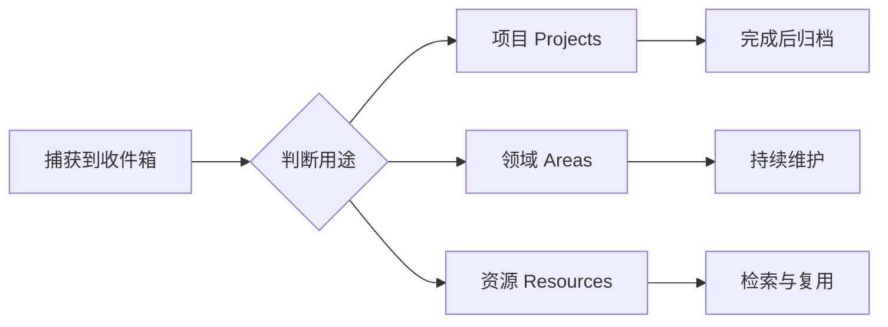

# Obsidian PARA + PKM 模板

一个面向 Obsidian 新手的个人知识管理模板，用 PARA 方法组织项目、领域、资源和归档，并提供主页、索引、日记与常用笔记模板。



## 项目状态

- 当前形态：可直接复制的 Obsidian Vault 模板
- 方法：PARA + 收件箱 + 日记/周记
- 动态能力：Dataview 生成索引，Tasks 汇总任务
- 分发边界：不打包第三方插件、主题、账号数据或个人工作区状态

## 包含内容

- PARA 目录结构与收件箱
- 项目、领域、资源、日记和周记模板
- 主页、任务、项目、领域与资源索引
- Obsidian 核心插件的基础配置
- Dataview 与 Tasks 查询示例

仓库只保存模板内容和必要配置，不打包第三方插件、主题或个人工作区状态。

## 快速开始

1. 下载或克隆仓库。
2. 在 Obsidian 中选择“打开本地仓库”，打开项目根目录。
3. 阅读 `00-主页/快速上手.md`。
4. 按 `00-主页/插件使用教程.md` 安装需要的社区插件。

```bash
git clone https://github.com/Yang642514/obsidian-para-pkm-template.git
```

## 目录结构

```text
├── 00-主页/          # 主页、仪表盘和索引
├── 01-项目/          # 有明确目标和完成条件的事项
├── 02-领域/          # 需要持续维护的责任领域
├── 03-资源/          # 可复用的资料与知识
├── 04-归档/          # 已完成或不再活跃的内容
├── _收件箱/          # 尚未整理的输入
├── _模板/            # 笔记模板
└── 日记/             # 日记和周记
```

## 插件依赖

动态索引依赖以下社区插件，请在 Obsidian 的社区插件市场中自行安装：

| 插件 | ID | 用途 |
| --- | --- | --- |
| Dataview | `dataview` | 生成项目、领域、资源和日记索引 |
| Tasks | `obsidian-tasks-plugin` | 汇总任务和截止日期 |

Calendar、Homepage、Omnisearch、Recent Files 和 Tag Wrangler 属于可选增强项。模板不会自动下载或启用任何社区插件。

## 使用说明

- 不安装社区插件时，目录、普通笔记和核心模板仍可使用；动态查询代码块会显示为普通代码。
- `_模板/` 已配置为 Obsidian 核心模板目录。
- 日记默认保存在 `日记/`，文件名格式为 `YYYY-MM-DD`。
- 示例内容用于演示结构，可以按需替换或删除。

## 贡献

欢迎通过 Issue 或 Pull Request 提交问题和改进建议。

## 许可证

本项目采用 [MIT License](LICENSE)。第三方插件和主题不包含在本仓库中，其授权以各自项目为准。
